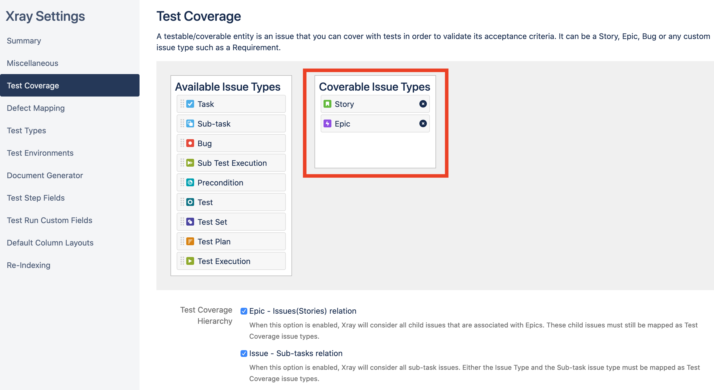
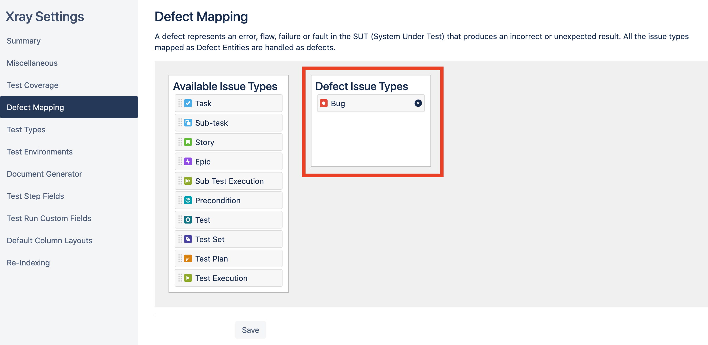

This script creates a demonstration project for [Xray](https://www.getxray.app/) in [Jira Cloud Software](https://www.atlassian.com/software/jira/free).

The created demo project contains:
 - *Requirement* issues (Epics and Stories), 
 - Test cases (Manual, Cucumber, Robot Framework, Nunit, JUnit, TestNG)
 - Preconditions
 - Test Sets
 - Test Repository folder structure
 - Test Plans
 - Test Executions

# Description

The [resources/data.json](./resources/data.json) file contains all the information to create the initial issues and their associations.
There are also other resource files used to import execution results in various technologies.

The script uses APIs from Jira and Xray to create all the entities based in these resources.

 - [demo.py](./demo.py) main script file. Drives the flow by consuming the resource files and sending the appropriate API requests.
 - [jira.py](./jira.py) Jira API helper
 - [xray.py](./xray.py) Xray API helper 
 - [resources/](./resources/) the resouces folder where the data and execution result files can be found

# Requirements

 * A [Jira Cloud Software](https://www.atlassian.com/software/jira/free) instance with [Xray](https://www.getxray.app/) installed
 * A Jira user email and respective API TOKEN: (https://confluence.atlassian.com/cloud/api-tokens-938839638.html)
 * An Xray API Key: (https://docs.getxray.app/display/XRAYCLOUD/Global+Settings%3A+API+Keys)

# How to use

The script is written in [Python](https://www.python.org/). You must install [Python 3.x](https://www.python.org/about/gettingstarted/) in order to execute the script.

## Setup

In order to run this script you need to provide the following information in the [credentials.py](./credentials.py) file:
 - Jira Instance URL
 - Jira user email
 - Jira API token
 - Xray API Key (client and secret)

```python
# Jira credentials
INSTANCE = 'https://my-xray-demo.atlassian.net'
USER = 'xxxx'
TOKEN = 'xxxx'

# Xray credentials
CLIENT_ID = 'XXXXXXXXXXXXXXXXXX'
CLIENT_SECRET = 'XXXXXXXXXXXXXXXXXX'
```

## Running the script

```
> pip install requests
> python3 demo.py

usage: demo.py [-h] [-s] [-v]

optional arguments:
  -h, --help     show this help message and exit
  -s, --salt     appends 3 random chars to the project name (useful if you already have a project with the same name or key)
  -v, --verbose  enables verbose logging
```

## Final steps

By now, you should have a new project named "Book Store Web app" in your Jira instance. There are just a couple of things you need to do:

1. Configure the **Test Coverage** and **Defect Mapping** on the Xray project settings.
2. Create a dashboard to demonstrate Xray Gadgets and reports.

... and thats it.




# Future work

The [jira.py](./jira.py) and [xray.py](./xray.py) files are just abstractions of the respective APIs. We can improve these abstractions in order to support different data and fields specified in the [data.json](./resources/data.json) file.

# License

Licensed under the New BSD License. See the [LICENSE](./LICENSE.md) file for details.

# Disclaimer

Please note: the scripts in this repo are released for use "AS IS" without any warranties of any kind, including, but not limited to their installation, use, or performance. We disclaim any and all warranties, either express or implied, including but not limited to any warranty of noninfringement, merchantability, and/ or fitness for a particular purpose. We do not warrant that the technology will meet your requirements, that the operation thereof will be uninterrupted or error-free, or that any errors will be corrected.

Any use of these scripts is at your own risk. There is no guarantee that they have been through thorough testing in a comparable environment and we are not responsible for any damage or data loss incurred with their use.

You are responsible for reviewing and testing any scripts you run thoroughly before use in any non-testing environment.
